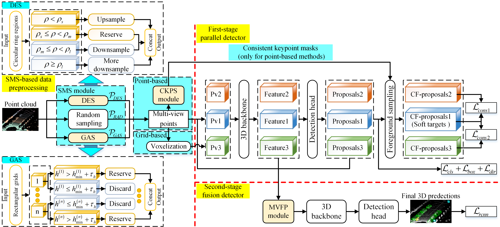

# Boosting 3D Object Detection With Semantic-Aware Multi-Branch Framework

This is the official implementation of "Boosting 3D Object Detection With Semantic-Aware Multi-Branch Framework". This repository is based on [`OpenPCDet`](https://github.com/open-mmlab/OpenPCDet).

**Abstract**: In autonomous driving, LiDAR sensors are vital for acquiring 3D point clouds, providing reliable geometric information. However, traditional sampling methods of preprocessing often ignore semantic features, leading to detail loss and ground point interference in 3D object detection. To address this, we propose a multi-branch two-stage 3D object detection framework using a Semantic-aware Multi-branch Sampling (SMS) module and multi-view consistency constraints. The SMS module includes random sampling, Density Equalization Sampling (DES) for enhancing distant objects, and Ground Abandonment Sampling (GAS) to focus on non-ground points. The sampled multi-view points are processed through a Consistent KeyPoint Selection (CKPS) module to generate consistent keypoint masks for efficient proposal sampling. The first-stage detector uses multi-branch parallel learning with multi-view consistency loss for feature aggregation, while the second-stage detector fuses multi-view data through a Multi-View Fusion Pooling (MVFP) module to precisely predict 3D objects. The experimental results on the KITTI dataset and Waymo Open Dataset show that our method achieves excellent detection performance improvement for a variety of backbones, especially for low-performance backbones with simple network structures.



## Dataset
This paper uses standard 3D object detection data from the official KITTI Dataset and Waymo Open Dataset, following conventional file path configurations. Researchers can download these datasets and adjust the corresponding paths in OpenPCDet to reproduce the experiments described in this paper.

## Training
```
cd tools/
```
Training the SMS-PointRCNN model on the KITTI dataset using a single GPU:
```
python train.py --cfg_file ./cfgs/kitti_models/pointrcnn_multiview.yaml
```
Training the SMS-PVRCNN model on the KITTI dataset using a single GPU:
```
python train.py --cfg_file ./cfgs/kitti_models/pv_rcnn_multiview.yaml
```
Training the SMS-PVRCNN++ model on the KITTI dataset using a single GPU:
```
python train.py --cfg_file ./cfgs/kitti_models/pvrcnn_plusplus_multiview.yaml
```
Training the SMS-PVRCNN model on the Waymo Open Dataset using 4 GPUs:
```
CUDA_VISIBLE=0,1,2,3 python -m torch.distributed.run --nproc_per_node=4 train.py --cfg_file ./cfgs/waymo_models/pv_rcnn_multiview.yaml
```
Training the SMS-PVRCNN++ model on the Waymo Open Dataset using 4 GPUs:
```
CUDA_VISIBLE=0,1,2,3 python -m torch.distributed.run --nproc_per_node=4 train.py --cfg_file ./cfgs/waymo_models/pvrcnn_plusplus_multiview.yaml
```

## Testing
```
cd tools/
```
Testing all checkpoints starting from checkpoint_65 for the SMS-PVRCNN model using a single GPU:
```
python test.py --cfg_file ./cfgs/kitti_models/pv_rcnn_multiview.yaml --ckpt ../output/cfgs/kitti_models/pv_rcnn_multiview/default/ckpt/checkpoint_epoch_65.pth --eval_all
```

Testing all checkpoints starting from checkpoint_65 for the SMS-PVRCNN model using 4 GPUs:
```
CUDA_VISIBLE=0,1,2,3 python -m torch.distributed.run --nproc_per_node=4 test.py --cfg_file ./cfgs/waymo_models/pv_rcnn_multiview.yaml --ckpt ../output/cfgs/kitti_models/pv_rcnn_multiview/default/ckpt/checkpoint_epoch_65.pth --eval_all
```

## License

`SMS` is released under the [Apache 2.0 license](LICENSE).

## Acknowledgement
[`OpenPCDet`](https://github.com/open-mmlab/OpenPCDet)

## Citation 

If you find this project useful in your research, please consider cite:

```
@ARTICLE{10836835,
  author={Jing, Hao and Wang, Anhong and Zhao, Lijun and Yang, Yakun and Bu, Donghan and Zhang, Jing and Zhang, Yifan and Hou, Junhui},
  journal={IEEE Transactions on Circuits and Systems for Video Technology}, 
  title={Boosting 3D Object Detection With Semantic-Aware Multi-Branch Framework}, 
  year={2025},
  volume={35},
  number={6},
  pages={5697-5710},
  keywords={Three-dimensional displays;Semantics;Feature extraction;Proposals;Point cloud compression;Object detection;Detectors;Data preprocessing;Sampling methods;Interference;Point clouds;3D object detection;sampling method;preprocessing},
  doi={10.1109/TCSVT.2025.3527997}}
```

## Email 

If you have any questions, please contact jinghao@tyust.edu.cn.
